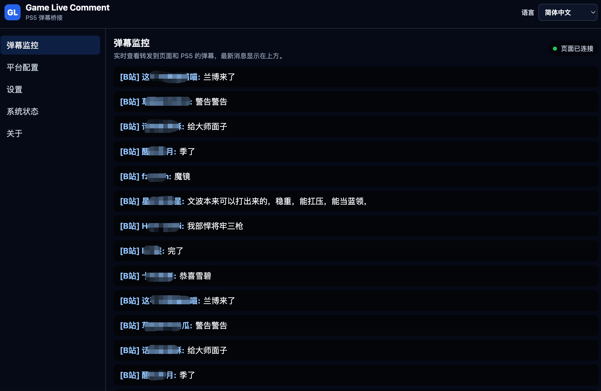
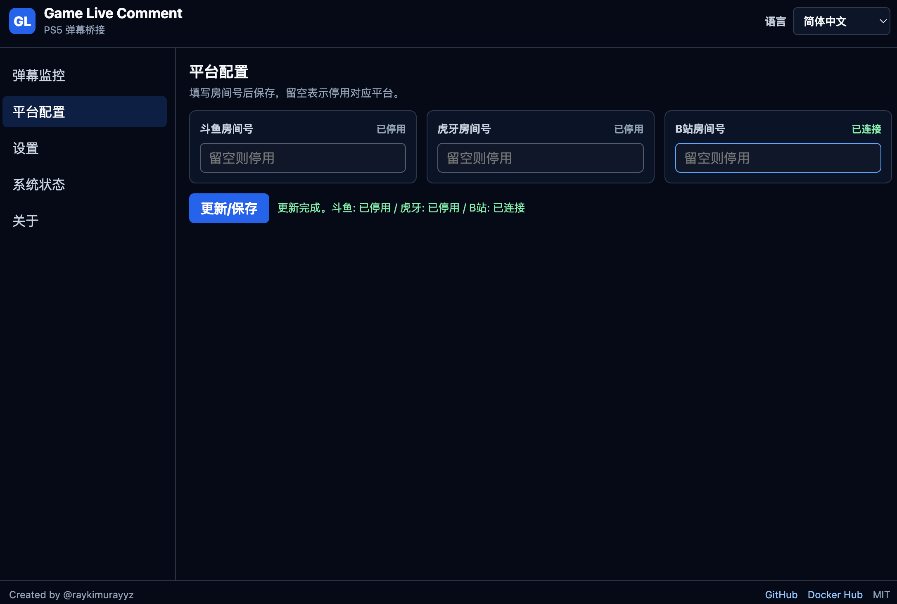
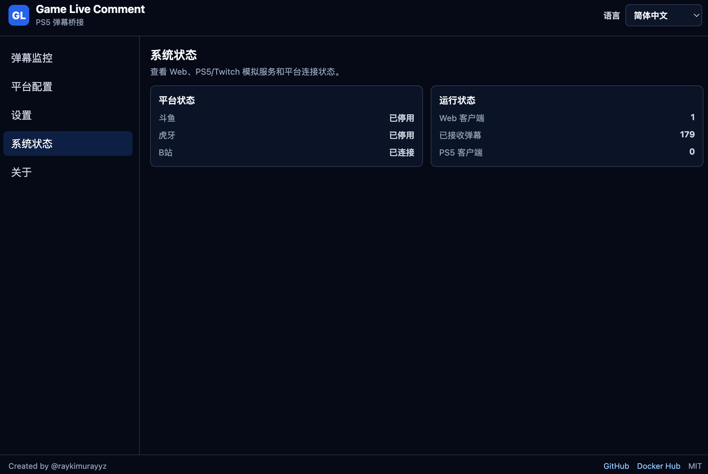

# Game Live Comment 中文说明

[](https://github.com/raykimurayyz/game-live-comment/actions/workflows/ci.yml)
[](https://hub.docker.com/r/raykimurayyz/gamelivecomment)
[](https://hub.docker.com/r/raykimurayyz/gamelivecomment/tags)
[](LICENSE)

[English](README.md) · [Docker Hub](https://hub.docker.com/r/raykimurayyz/gamelivecomment)

Game Live Comment 用于把指定直播平台的弹幕转发到 PlayStation 的 Twitch 聊天浮层，同时提供本地 Web 监控页面。

它复用 PlayStation 系统自带的直播聊天链路，把转换后的弹幕内容串流到主机浮层，让斗鱼、虎牙或 B 站弹幕可以在 PlayStation 直播时显示。

## 功能介绍

- 转发斗鱼、虎牙和 B 站弹幕。
- 在本地模拟 Twitch IRC/TMI，让 PlayStation 广播聊天浮层接收转换后的弹幕。
- 提供 Web 页面，用于填写房间号、查看连接状态和监控实时弹幕。
- 房间配置可以通过 Docker volume 持久化。
- 界面语言只保存在当前浏览器，不写入容器配置。
- 界面支持英文、中文和日文。

## 界面截图

### 弹幕监控



### 房间设置



### 系统状态



### PlayStation 浮层效果


## Docker 快速开始

启动容器：

```bash
docker run -d \
  --name gamelivecomment \
  --restart unless-stopped \
  -p 3010:3010 \
  -p 6667:6667 \
  -v gamelivecomment-data:/app/data \
  raykimurayyz/gamelivecomment:latest
```

打开 Web 页面：

```text
http://127.0.0.1:3010/
```

然后：

1. 填写斗鱼、虎牙或 B 站房间号。
2. 保存设置。
3. 确认平台状态变成已连接。
4. 配置 PlayStation 的 DNS 重定向。
5. 在主机上开始 Twitch 直播，并开启聊天显示。

## Web 页面使用

推荐通过 Web 页面使用本项目。

- 房间设置：修改斗鱼、虎牙和 B 站房间号。
- 房间号留空：停用对应平台。
- 关闭启用开关：保留房间号，但断开并停用对应平台。
- 平台状态：显示已连接、已停用或错误。
- 弹幕监控：实时显示收到的弹幕。
- 语言选择：语言只保存到当前浏览器。

页面提交后会立即切换运行中的平台连接，并写回 `config.json` 或 `CONFIG_PATH` 指向的配置文件。官方 Docker 镜像默认使用 `CONFIG_PATH=/app/data/config.json`，建议通过 Docker named volume 持久化 `/app/data`。更新镜像并重建容器时，只要继续使用同一个 volume，页面里保存的房间号会保留。

如果 Docker 启动时设置了 `DOUYU_ROOM_ID` 等环境变量，容器重启后环境变量仍会覆盖页面保存的配置。

## PlayStation DNS 重定向

把这些 Twitch IRC 域名重定向到运行本服务的机器：

- `irc.twitch.tv:6667`
- `tmi.twitch.tv:6667`

当前版本不内置 DNS 服务。可以使用独立 DNS 服务，或者通过路由器/DNS 规则实现重定向。

## 端口

- `3010/tcp`：HTTP API 和 Web 页面
- `6667/tcp`：给 PlayStation 使用的 Twitch IRC/TMI 模拟器

## Docker 配置

官方 Docker 镜像会把房间配置保存到 `/app/data/config.json`。更新镜像并重建容器时，只要继续使用同一个 Docker volume，页面里保存的房间号会保留。

支持的环境变量：

| 变量 | 说明 |
| --- | --- |
| `SERVER_HOST` | HTTP 和 IRC 监听地址 |
| `HTTP_PORT` | HTTP API 和 Web 页面端口 |
| `IRC_PORT` | Twitch IRC 模拟器端口 |
| `DOUYU_ENABLED` | 可选强制开关。设为 `false` 时，即使配置了 `DOUYU_ROOM_ID` 也禁用斗鱼。 |
| `DOUYU_ROOM_ID` | 斗鱼房间号 |
| `DOUYU_INCLUDE_GIFTS` | 是否包含斗鱼礼物 |
| `HUYA_ENABLED` | 可选强制开关。设为 `false` 时，即使配置了 `HUYA_ROOM_ID` 也禁用虎牙。 |
| `HUYA_ROOM_ID` | 虎牙房间号 |
| `HUYA_INCLUDE_GIFTS` | 是否包含虎牙礼物 |
| `BILIBILI_ENABLED` | 可选强制开关。设为 `false` 时，即使配置了 `BILIBILI_ROOM_ID` 也禁用 B 站。 |
| `BILIBILI_ROOM_ID` | B 站房间号 |
| `BILIBILI_INCLUDE_GIFTS` | 是否包含 B 站礼物 |
| `OUTPUT_FORMAT` | 发送到 PlayStation 的消息格式 |
| `QUEUE_INTERVAL_MS` | IRC 输出间隔 |

配置 `DOUYU_ROOM_ID`、`HUYA_ROOM_ID` 或 `BILIBILI_ROOM_ID` 会自动启用对应平台。如需强制禁用已配置的平台，设置对应的 `*_ENABLED=false`。

房间不存在或无法解析时，对应平台状态会变成 `error`，不会继续重连。

## 开发调试

```bash
npm install
npm run dev
```

打开：

- `http://127.0.0.1:3010/`
- `http://127.0.0.1:3010/api/status`

发送本地测试弹幕：

```bash
curl -X POST http://127.0.0.1:3010/api/test-comment \
  -H 'content-type: application/json' \
  -d '{"username":"本地测试","content":"hello playstation"}'
```

## API

- `GET /`：Web 设置和监控页面
- `GET /overlay`：同一个 Web 页面，可作为 OBS 浏览器源
- `GET /api/status`：查看服务、平台、队列和最近弹幕状态
- `POST /api/test-comment`：发送本地测试弹幕
- `POST /api/platforms/douyu/room`：更新斗鱼房间号和启用状态
- `POST /api/platforms/huya/room`：更新虎牙房间号和启用状态
- `POST /api/platforms/bilibili/room`：更新 B 站房间号和启用状态

平台房间更新请求：

```json
{ "roomId": "123456", "enabled": true }
```

把 `enabled` 设为 `false` 时，会保留房间号，但断开并停用对应平台。

## 自检

自动化测试覆盖 PlayStation 依赖的本地 Twitch IRC/TMI 行为：

- `CAP REQ` 返回 Twitch capability ACK
- `NICK` 返回 IRC welcome 握手
- `JOIN` 返回 join 和 names 响应
- `PING` 返回 `PONG`
- 弹幕格式化为 Twitch `PRIVMSG`
- `CommentBus` 会先排队，再广播到 IRC 客户端

运行：

```bash
npm run test
```

自动化测试不能证明 DNS 重定向和真实主机屏幕显示。真实效果仍然需要主机实机测试。

## 许可证

本项目使用 MIT 许可证。详情见 [LICENSE](LICENSE)。
