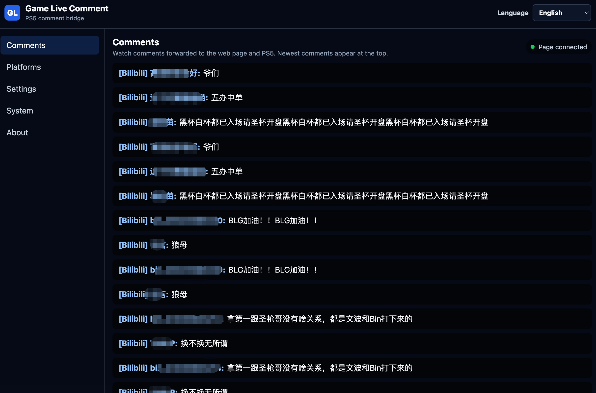
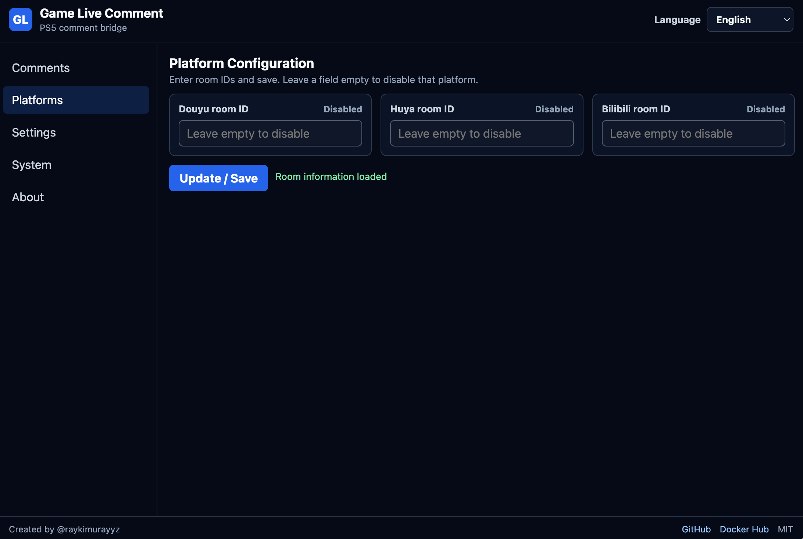
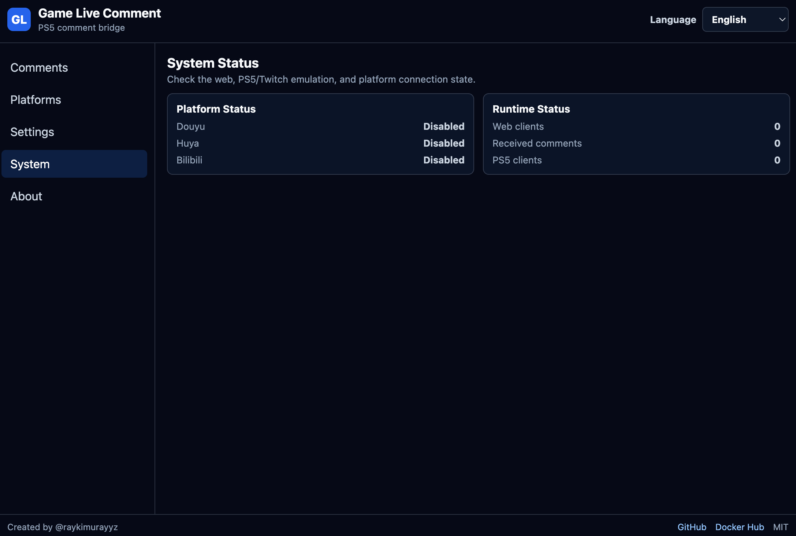
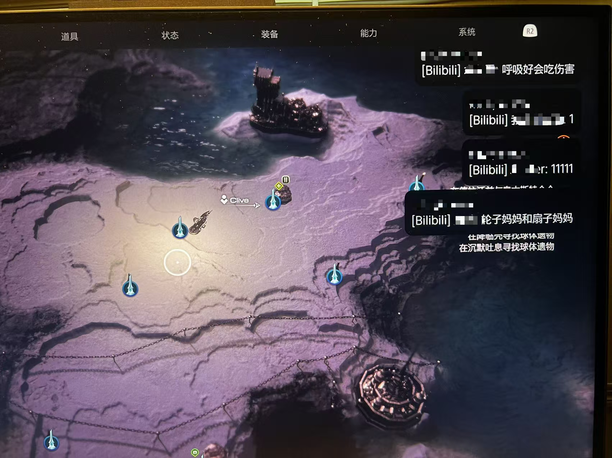

# Game Live Comment

[](https://github.com/raykimurayyz/game-live-comment/actions/workflows/ci.yml)
[](https://hub.docker.com/r/raykimurayyz/gamelivecomment)
[](https://hub.docker.com/r/raykimurayyz/gamelivecomment/tags)
[](LICENSE)

[中文说明](README-CN.md)

Game Live Comment forwards live comments from specified streaming platforms to a PlayStation Twitch chat overlay and a local web monitor.

It uses the built-in PlayStation broadcast chat flow to stream converted comments into the console overlay, so Douyu, Huya, or Bilibili messages can appear while broadcasting from the console.

## What It Does

- Forwards comments from Douyu, Huya, and Bilibili.
- Emulates Twitch IRC/TMI locally so PlayStation broadcast chat can receive converted comments.
- Provides a web page for room setup, connection status, and live comment monitoring.
- Saves room settings in Docker volume storage.
- Stores UI language in the current browser only.
- Supports English, Chinese, and Japanese UI text.

## Screenshots

### Live Monitor



### Room Settings



### System Status



### PlayStation Overlay



## Quick Start With Docker

Start the container:

```bash
docker run -d \
  --name gamelivecomment \
  --restart unless-stopped \
  -p 3010:3010 \
  -p 6667:6667 \
  -v gamelivecomment-data:/app/data \
  raykimurayyz/gamelivecomment:latest
```

Open the web page:

```text
http://127.0.0.1:3010/
```

Then:

1. Enter the room ID for Douyu, Huya, or Bilibili.
2. Save the settings.
3. Confirm the platform status becomes connected.
4. Configure your PlayStation DNS redirect.
5. Start a Twitch broadcast from the console and enable chat display.

## Web Page Usage

The web page is the recommended way to use the app.

- Room settings: update Douyu, Huya, and Bilibili room IDs.
- Empty room ID: disables that platform.
- Enabled switch off: keeps the room ID but disconnects that platform.
- Platform status: shows connected, disabled, or error.
- Live monitor: shows received comments in real time.
- Language selector: saves the selected language in the current browser.

Room changes are applied immediately and saved to `config.json` or the file pointed to by `CONFIG_PATH`. The official Docker image uses `CONFIG_PATH=/app/data/config.json`; use the same Docker volume when recreating the container to keep saved room IDs after image updates.

If Docker environment variables such as `DOUYU_ROOM_ID` are set, they still take precedence after the container restarts.

## PlayStation DNS Redirect

Redirect these Twitch IRC domains to the machine running this service:

- `irc.twitch.tv:6667`
- `tmi.twitch.tv:6667`

DNS is intentionally not bundled in this version. Use your own DNS service or router-level DNS override.

## Ports

- `3010/tcp`: HTTP API and web page
- `6667/tcp`: Twitch IRC/TMI emulator for PlayStation

## Docker Configuration

The official Docker image stores room settings in `/app/data/config.json`. Use the same Docker volume when recreating the container to keep saved room IDs after image updates.

Supported environment variables:

| Variable | Meaning |
| --- | --- |
| `SERVER_HOST` | HTTP and IRC bind host |
| `HTTP_PORT` | HTTP API and web page port |
| `IRC_PORT` | Twitch IRC emulator port |
| `DOUYU_ENABLED` | Optional force switch. `false` disables Douyu even when `DOUYU_ROOM_ID` is set. |
| `DOUYU_ROOM_ID` | Douyu room ID |
| `DOUYU_INCLUDE_GIFTS` | Include Douyu gifts |
| `HUYA_ENABLED` | Optional force switch. `false` disables Huya even when `HUYA_ROOM_ID` is set. |
| `HUYA_ROOM_ID` | Huya room ID |
| `HUYA_INCLUDE_GIFTS` | Include Huya gifts |
| `BILIBILI_ENABLED` | Optional force switch. `false` disables Bilibili even when `BILIBILI_ROOM_ID` is set. |
| `BILIBILI_ROOM_ID` | Bilibili room ID |
| `BILIBILI_INCLUDE_GIFTS` | Include Bilibili gifts |
| `OUTPUT_FORMAT` | PlayStation message format |
| `QUEUE_INTERVAL_MS` | IRC output interval |

Setting `DOUYU_ROOM_ID`, `HUYA_ROOM_ID`, or `BILIBILI_ROOM_ID` automatically enables that platform. Use `*_ENABLED=false` only when you want to force-disable a configured platform.

If a configured room cannot be resolved, that platform enters `error` status and will not keep reconnecting.

## Development

```bash
npm install
npm run dev
```

Open:

- `http://127.0.0.1:3010/`
- `http://127.0.0.1:3010/api/status`

Send a local test comment:

```bash
curl -X POST http://127.0.0.1:3010/api/test-comment \
  -H 'content-type: application/json' \
  -d '{"username":"Local Test","content":"hello playstation"}'
```

## API

- `GET /`: web page for setup and monitoring
- `GET /overlay`: the same web page, useful as an OBS browser source
- `GET /api/status`: service, platform, queue, and recent comment status
- `POST /api/test-comment`: publish a local test comment
- `POST /api/platforms/douyu/room`: update Douyu room and enabled state
- `POST /api/platforms/huya/room`: update Huya room and enabled state
- `POST /api/platforms/bilibili/room`: update Bilibili room and enabled state

Platform room update payload:

```json
{ "roomId": "123456", "enabled": true }
```

Set `enabled` to `false` to keep the room ID but disconnect that platform.

## Self Check

Automated checks cover the local Twitch IRC/TMI behavior that PlayStation depends on:

- `CAP REQ` returns Twitch capability ACK
- `NICK` returns IRC welcome handshake
- `JOIN` returns join and names responses
- `PING` returns `PONG`
- comments are formatted as Twitch `PRIVMSG`
- `CommentBus` queues comments before broadcasting to IRC clients

Run:

```bash
npm run test
```

Automated tests cannot prove DNS redirection or the real console screen overlay. Those still require a console smoke test.

## License

This project is licensed under the MIT License. See [LICENSE](LICENSE) for details.
